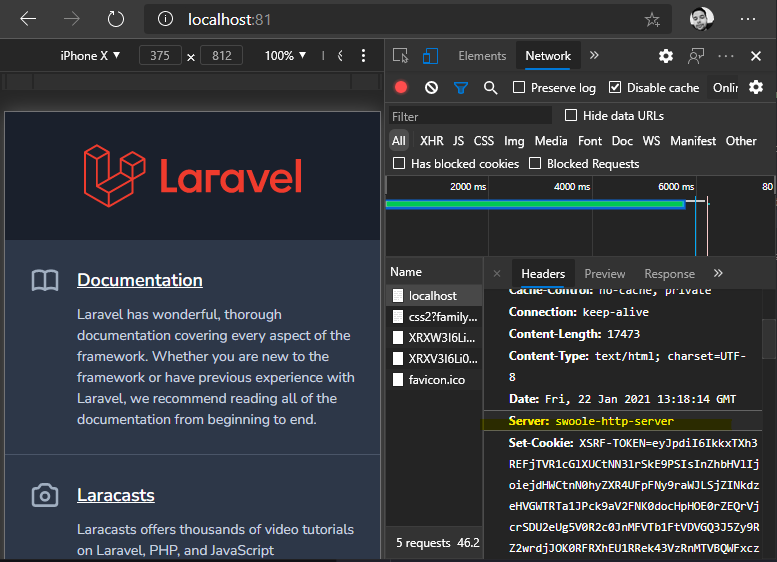

# Nginxless
PoC of Swoole serving PHP-FPM requests for popular frameworks like Laravel &amp; WordPress.

## What is going on?
PHP-FPM running daemonized and Swoole proxying HTTP request to it.

## Why?
The idea came from the insight of having a single point of truth for Dockerized PHP projects. No Nginx, nor Apache etc; so: creating a web-server with PHP itself (thank you Swoole).

## Caveats
- You won't be able to use Coroutines. This is suitable for legacy projects where you can't start with Swoole from scratch.
